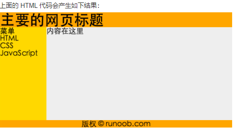
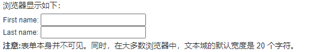
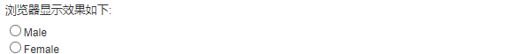
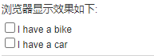
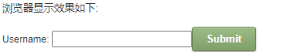
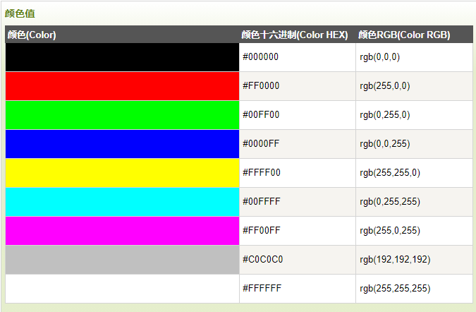
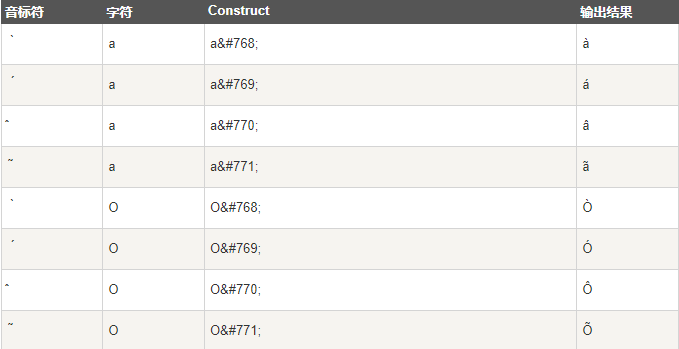
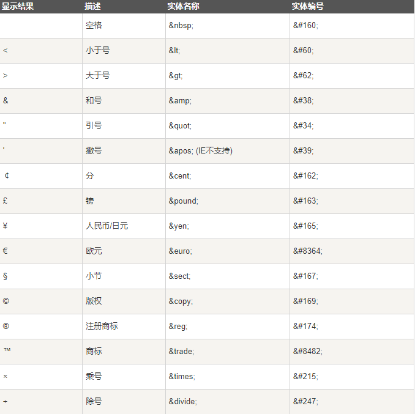

# HTML学习笔记

## HTML简介

超文本标记语言（英语：HyperText Markup Language，简称：HTML）是一种用于创建网页的标准标记语言。html使用标记标签来描述网页，标签是用尖括号包围的关键词<>，且总是成对出现，例<font color= 'red'> <html>      </html> </font>其中<html>称为开始标签，</html>称为结束标签。HTML文档=网页，包含HTML标签和纯文本。

<!--more-->

html文件后缀  .html/.htm 都可以使用，没有区别

<font color='red'>**注意：**对于中文网页需要使用 **<meta charset="utf-8">** 声明编码，否则会出现乱码。有些浏览器(如 360 浏览器)会设置 GBK 为默认编码，则你需要设置为**<meta charset="gbk">。**</font>

参考W3school：

[HTML实例](https://www.w3school.com.cn/example/html_examples.asp)

[HTML参考手册](https://www.w3school.com.cn/tags/index.asp)

可以学习html的网站：

- [W3school](https://www.w3school.com.cn/)

- [菜鸟教程](https://www.runoob.com/html/html-tutorial.html)

- [freecodecamp(html练习)](https://www.freecodecamp.one/)

  

  

## HTML编辑器

编写html文件的编辑器有很多，可以使用Notepad或者TextEdit，sublime来编写HTML，文本编辑器同样可以编写html文件，如简单的txt文本编辑器，Typora文本编辑器。同样有专业编写HTML的编辑器。

- Adobe Dreamweaver
- Microsoft Expression Web
- CoffeeCup HTML Editor

## HTML元素

**注：为保证显示，所有标签前后都加了空格。**

### HTML元素语法

html元素指开始标签到结束标签的所有代码。

语法：

- 以开始标签开始

- 以结束标签结束

- html元素的内容指开始标签到结束标签之间的内容

- 某些html元素具有空内容

- 空元素在开始标签中进行关闭

- html元素可拥有属性

  

### HTML元素嵌套

多数html元素可以嵌套其他的html元素

例：

```
<html>

<body>
<p>html学习笔记</p>
</body>

</html>
```

其中< body >和< p >便嵌套在< html >元素中

### 空的HTML元素

没有内容的HTML元素被称为空元素。空元素在开始标签中被关闭。**< br >**（定义换行）就是没有结束标签的html空元素。**< br >**在所有浏览器中都有效，长远起见建议使用**< br/ >**

## HTML属性

html中的属性是为元素提供附加信息。属性以名称/值对的形式出现。例如：name="value"。属性总在开始标签中定义。

属性值始终被包括在尖括号中，且属性值应该被加以引号，双括号和单引号都可以，但双引号是最常见的。

<font color=red>*注意：当属性值本身带有双引号时，对属性值使用单引号*</font>

[HTML标准属性参考手册](https://www.w3school.com.cn/tags/index.asp)

属性实例

```
<a href="http://www.w3school.com.cn">This is a link</a>
```


## HTML标题

在html中，标题(heading)通过标签<font color="red">< h1 >-< h6 ></font>来进行定义

其中< h1 >定义最大的标题，< h6 >定义最小的标题

<font color="red">注意：浏览器会自动地在标题的前后添加空行</font>

### HTML水平线

<h r />标签用于在html页面中创建水平线

所以hr元素可以用于分隔内容

实例：

```
<p>This is a paragraph</p>
<hr />
<p>This is a paragraph</p>
<hr />
<p>This is a paragraph</p>
```

### HTML注释

注释的作用是提高代码可读性，可以更容易被人所理解，浏览器不会显示注释内容

html中使用<!--  注释  -->来编写注释

实例：

```
<!-- This is a comment -->
```

可以注释一行或一段代码

实例：

```
<!-- 此刻不显示图片：

-->
```


## HTML段落

html中通过<p>标签定义段落，这样可以把html段落划分为若干个段落，标签<p>有结束标签</p>,但是不写结束标签大多数浏览器也能正常的显示出来，为了形成好习惯，一般都会写上结束标签。

在html中会遇到空行问题，使用< p >< /p >能够产生空行，但是更建议使用上面说到的没有结束标签的html标签< br/ >

实例：

```
<p>This is a paragraph</p>
<p>This is another paragraph</p>
```


## HTML样式

html中style属性用于改变html元素的样式

实例：

```
<!--背景颜色:background-cloor-->
<html>

<body style="background-color:yellow">
<h2 style="background-color:red">This is a heading</h2>
<p style="background-color:green">This is a paragraph.</p>
</body>

</html>
```

```
<!--设置字体颜色和尺寸:font-family、color、font-size-->
<html>

<body>
<h1 style="font-family:verdana">A heading</h1>
<p style="font-family:arial;color:red;font-size:20px;">A paragraph.</p>
</body>

</html>
```

```
<!--文本对齐-->
<html>

<body>
<h1 style="text-align:center">This is a heading</h1>
<p>The heading above is aligned to the center of this page.</p>
</body>

</html>
```


## HTML文本格式化

html很多标签提供多种输出格式的标签

文本格式化标签：

| 标签       | 描述                                  |
| :--------- | :------------------------------------ |
| < b >      | 定义粗体文本。                        |
| < big >    | 定义大号字。                          |
| < em >     | 定义着重文字。                        |
| < i >      | 定义斜体字。                          |
| < samll >  | 定义小号字。                          |
| < strong > | 定义加重语气。                        |
| < sub >    | 定义下标字。                          |
| < sup >    | 定义上标字。                          |
| < ins >    | 定义插入字。                          |
| < del >    | 定义删除字。                          |
| < s >      | *不赞成使用。*使用 < del > 代替。     |
| < strike > | *不赞成使用。*使用 < del > 代替。     |
| < u >      | *不赞成使用。*使用样式（style）代替。 |

计算机输出标签：

| 标签          | 描述                              |
| :------------ | :-------------------------------- |
| < code >      | 定义计算机代码。                  |
| < kbd >       | 定义键盘码。                      |
| < samp >      | 定义计算机代码样本。              |
| < tt >        | 定义打字机代码。                  |
| < var >       | 定义变量。                        |
| < pre >       | 定义预格式文本。                  |
| < listing >   | *不赞成使用。*使用 < pre > 代替。 |
| < plaintext > | *不赞成使用。*使用 < pre > 代替。 |
| < xmp >       | *不赞成使用。*使用 < pre > 代替。 |

引用和术语定义：

| 标签           | 描述               |
| :------------- | :----------------- |
| < abbr >       | 定义缩写。         |
| < acronym >    | 定义首字母缩写。   |
| < address >    | 定义地址。         |
| < bdo >        | 定义文字方向。     |
| < blackquote > | 定义长的引用。     |
| < q >          | 定义短的引用语。   |
| < cite >       | 定义引用、引证。   |
| < dfn >        | 定义一个定义项目。 |


## HTML引用

在html文本格式化中有提到引用的标签

### < q >

< q >标签用于短的引用，浏览器会对< q >标签所所引用的内容加上引号

实例：

```
<p>WWF 的目标是：<q>构建人与自然和谐共存的世界。</q></p>
```

### < blockquote >

< blockquote >标签用于长引用，并且浏览器通常会对< blockquote >元素进行缩进处理

实例：

```
<p>以下内容引用自 WWF 的网站：</p>
<blockquote cite="http://www.worldwildlife.org/who/index.html">
五十年来，WWF 一直致力于保护自然界的未来。
世界领先的环保组织，WWF 工作于 100 个国家，
并得到美国一百二十万会员及全球近五百万会员的支持。
</blockquote>
```

### < abbr >

< abbr >元素定义缩写或者首字母缩略语

对缩写进行标记能够为浏览器，翻译系统以及搜索引擎提供有用的信息

实例：

```
<p><abbr title="World Health Organization">WHO</abbr> 成立于 1948 年。</p>
```

### < dfn >

< dfn >元素定义项目或缩写的定义

1.如果< dfn >中设置了tittle属性，则定义项目：

```
<p><dfn title="World Health Organization">WHO</dfn> 成立于 1948 年。</p>
```

2.如果< dfn >元素包含具有标题的< abbr >元素，则tittle定义项目：

```
<p><dfn><abbr title="World Health Organization">WHO</abbr></dfn> 成立于 1948 年。</p>
```

3.如果什么都没有，则< dfn >文本内容即是项目，并且父元素包含定义：

```
<p><dfn>WHO</dfn> World Health Organization 成立于 1948 年。</p>
```

### < address >

< address >元素用于定义文档的作者或者文章的联系信息

此元素通常以斜体显示，多数浏览器会在此元素的前后添加空行

实例：

```
<address>
Written by Donald Duck.<br> 
Visit us at:<br>
Example.com<br>
Box 564, Disneyland<br>
USA
</address>
```

### < cite >

< cite >元素用于定义元素的标题

浏览器通常会以斜体显示< cite >元素

实例：

```
<p><cite>The Scream</cite> by Edward Munch. Painted in 1893.</p>
```

### < bdo >

< bdo >元素定义双向流覆盖，会覆盖当前文本方向，即从右向左进行书写

实例：

```
<bdo dir="rtl">This text will be written from right to left</bdo>
```


## HTML计算机代码元素

html具有专门显示计算机代码的标签，不需要使用属性去专门修改字母尺寸和字母间距

### < kbd >

< kbd >元素定义计算机输入

实例：

```
<p>To open a file, select:</p>

<p><kbd>File | Open...</kbd></p>

```

### < samp >

< samp >元素定义计算机输出示例：

实例：

```
<samp>
demo.example.com login: Apr 12 09:10:17
Linux 2.6.10-grsec+gg3+e+fhs6b+nfs+gr0501+++p3+c4a+gr2b-reslog-v6.189
</samp>
```

### < code >

< code >元素定义编程代码示例：

实例：

```
<code>
var person = { firstName:"Bill", lastName:"Gates", age:50, eyeColor:"blue" }
</code>
```

且< code >元素不会保留多余的空格和折行，即所有代码内容会在一行输出

实例：

```
<p>Coding Example:</p>

<code>
var person = {
    firstName:"Bill",
    lastName:"Gates",
    age:50,
    eyeColor:"blue"
}
</code>
```

如果想解决这一问题，可以使用< pre >元素包围代码

实例：

```
<p>Coding Example:</p>

<code>
<pre>
var person = {
    firstName:"Bill",
    lastName:"Gates",
    age:50,
    eyeColor:"blue"
}
</pre>
</code>
```

此时代码内容会存在空格和折行，而不是在一行输出

### < var >

< var >元素定义数学变量

可以进行数学公式的输出

实例：

```
<p>Einstein wrote:</p>

<p><var>E = m c<sup>2</sup></var></p>
```

## HTML链接

HTML链接使用标签< a >来设置超文本链接，并在标签中使用href属性来描述链接的地址。

HTML链接语法

```
<a href="url">链接文本</a>
```

### target属性

使用target，可以定义被链接的文档显示在何处。

例：

```
<a href="https://www.runoob.com/" target="_blank" rel="noopener noreferrer">访问菜鸟教程!</a>
```

会在新窗口打开文档

“_top”则会在该窗口打开文档

### id属性

id属性可用于创建一个HTML文档书签，该书签不会在HTML页面中显示。

例：

```
<a id="tips">有用的提示部分</a>
<a href="#tips">访问有用的提示部分</a>
<a href="https://www.runoob.com/html/html-links.html#tips">
访问有用的提示部分</a>
```

## HTML头部

### < head >元素

< head > 元素包含了所有的头部标签元素。在 < head >元素中你可以插入脚本（scripts）, 样式文件（CSS），及各种meta信息。

可以添加在头部区域的元素标签为: < title >, < style >, < meta >, < link >, < script >, < noscript > 和 < base >。

### < title >元素

该标签定义了不同文档的标题

- 定义了浏览器工具栏的标题
- 当网页添加到收藏夹时，显示在收藏夹中的标题
- 显示在搜索引擎结果页面的标题

### < base >元素

描述了基本的链接地址/链接目标，作为HTML文档中所有的链接标签的默认链接。所有的< a >链接都是以其为基础。

### < link >元素

定义了文档与外部资源之间的关系，通常用于链接到样式表。

例：

```
<head>
<link rel="stylesheet" type="text/css" href="mystyle.css">
</head>
```

### < style >元素

定义了HTML文档的样式文件引用地址，也可直接添加样式来渲染HTML文档。

```
<head>
<style type="text/css">
body {background-color:yellow}
p {color:blue}
</style>
</head>
```

### < meta >元素

meta标签描述了一些基本的元数据。

< meta > 标签提供了元数据.元数据也不显示在页面上，但会被浏览器解析。

META 元素通常用于指定网页的描述，关键词，文件的最后修改时间，作者，和其他元数据。

元数据可以使用于浏览器（如何显示内容或重新加载页面），搜索引擎（关键词），或其他Web服务。

< meta > 一般放置于 < head > 区域

例：

```
为搜索引擎定义关键词
<meta name="keywords" content="HTML, CSS, XML, XHTML, JavaScript">
为网页定义描述内容
<meta name="description" content="免费 Web & 编程 教程">
定义网页作者
<meta name="author" content="Runoob">
每30秒刷新当前页面
<meta http-equiv="refresh" content="30">
```

### < script >元素

用于加载脚本文件，例javaScript

## HTML CSS

用于渲染HTML元素标签的样式

CSS可以通过一下方式添加到HTML中

- 内联样式：使用style属性
- 内部样式表：在HTML文档头部< head >区域使用style元素包含css
- 外部引用：使用外部css文件

最好的方式是通过外部引用css文件

### 内联样式

当特殊的样式需要应用到个别元素时，使用内联样式，在相关的标签种使用样式属性，可包含任何css属性。

例：

```
<p style="color:blue;margin-left:20px;">这是一个段落。</p>
```

使用（background－color）定义一个元素的背景颜色

例：

```
<body style="background-color:yellow;">
<h2 style="background-color:red;">这是一个标题</h2>
<p style="background-color:green;">这是一个段落。</p>
</body>
```

字体，字体颜色，字体大小

使用font-family color font-size来定义字体样式，颜色和大小。

例：

```
<h1 style="font-family:verdana;">一个标题</h1>
<p style="font-family:arial;color:red;font-size:20px;">一个段落。</p>
```

文本对齐方式

使用text-align(文字对齐)属性来指定文本的水平与垂直对齐方式

例：

```
<h1 style="text-align:center;">居中对齐的标题</h1>
<p>这是一个段落。</p>
```

### 内部样式表

当单个文件需要特别样式时，就可以使用内部样式表。你可以在<head> 部分通过 < style >标签定义内部样式表

例：

```
<head>
<style type="text/css">
body {background-color:yellow;}
p {color:blue;}
</style>
</head>
```

### 外部样式表

当样式需要被应用到很多页面的时候，外部样式表将是理想的选择，使用外部样式表，可以通过更改一个文件来改变整个站点的外观。

例：

```
<head>
<link rel="stylesheet" type="text/css" href="mystyle.css">
</head>
```

## HTML图像

图像由< img >标签定义，只包含属性，没有闭合标签。

要显示图像，需要使用src属性，其实指向图像的URL地址。

定义图像语法：

```

```

图像显示在图像标签出现的地方。

### alt属性

alt属性用来为图像定义一串预备的可替换的文本，替换文本属性的值由用户定义。

```

```

当浏览器无法载入图像时，替换文本属性告诉读者失去的信息，浏览器会显示替换性的文字，有助于更好的显示信息。

### 高度与宽度

使用width 和 height来定义图像的高度和宽度。

## HTML表格

表格由< table >标签定义，每个表格有若干行< tr > 每行的单元格由< td >定义。

数据单元格可以包含文本，图片，列表，段落，表单，水平线，表格等。

例：

```
<table border="1">
    <tr>
        <td>row 1, cell 1</td>
        <td>row 1, cell 2</td>
    </tr>
    <tr>
        <td>row 2, cell 1</td>
        <td>row 2, cell 2</td>
    </tr>
</table>
```

### HTML表格表头

表格的表头使用< th >标签定义。

例：

```
<table border="1">
    <tr>
        <th>Header 1</th>
        <th>Header 2</th>
    </tr>
    <tr>
        <td>row 1, cell 1</td>
        <td>row 1, cell 2</td>
    </tr>
    <tr>
        <td>row 2, cell 1</td>
        <td>row 2, cell 2</td>
    </tr>
</table>
```

## HTML列表

### 无序列表

用< ul >标签定义，每个列表项由< li >标签定义

例：

```
<ul>
<li>Coffee</li>
<li>Milk</li>
</ul>
```

### 有序列表

用< ol >标签定义

例：

```
<ol>
<li>Coffee</li>
<li>Milk</li>
</ol>
```

### 自定义列表

自定义列表是项目和注释的组合

以< dl >标签开始，表项以< dt >标签开始，自定义表项以< dd >标签开始

例：

```
<dl>
<dt>Coffee</dt>
<dd>- black hot drink</dd>
<dt>Milk</dt>
<dd>- white cold drink</dd>
</dl>
```

## HTML区块

HTML通过< div > 和 < span >将元素组合起来

内联元素在显示时通常不会以新行开始。

### < div > 

HTML < div > 元素是块级元素，它可用于组合其他 HTML 元素的容器。

<div> 元素没有特定的含义。除此之外，由于它属于块级元素，浏览器会在其前后显示折行。

如果与 CSS 一同使用，< div > 元素可用于对大的内容块设置样式属性。

< div > 元素的另一个常见的用途是文档布局。它取代了使用表格定义布局的老式方法。使用 < table > 元素进行文档布局不是表格的正确用法。< table > 元素的作用是显示表格化的数据。

### < span >

HTML < span > 元素是内联元素，可用作文本的容器

< span > 元素也没有特定的含义。

当与 CSS 一同使用时，< span > 元素可用于为部分文本设置样式属性。

## HTML布局

使用< div >创建多例布局

例：

```
<!DOCTYPE html>
<html>
<head> 
<meta charset="utf-8"> 
<title>菜鸟教程(runoob.com)</title> 
</head>
<body>
 
<div id="container" style="width:500px">
 
<div id="header" style="background-color:#FFA500;">
<h1 style="margin-bottom:0;">主要的网页标题</h1></div>
 
<div id="menu" style="background-color:#FFD700;height:200px;width:100px;float:left;">
<b>菜单</b><br>
HTML<br>
CSS<br>
JavaScript</div>
 
<div id="content" style="background-color:#EEEEEE;height:200px;width:400px;float:left;">
内容在这里</div>
 
<div id="footer" style="background-color:#FFA500;clear:both;text-align:center;">
版权 © runoob.com</div>
 
</div>
 
</body>
</html>
```



或使用表格进行布局

例：

```
<!DOCTYPE html>
<html>
<head> 
<meta charset="utf-8"> 
<title>菜鸟教程(runoob.com)</title> 
</head>
<body>
 
<table width="500" border="0">
<tr>
<td colspan="2" style="background-color:#FFA500;">
<h1>主要的网页标题</h1>
</td>
</tr>
 
<tr>
<td style="background-color:#FFD700;width:100px;">
<b>菜单</b><br>
HTML<br>
CSS<br>
JavaScript
</td>
<td style="background-color:#eeeeee;height:200px;width:400px;">
内容在这里</td>
</tr>
 
<tr>
<td colspan="2" style="background-color:#FFA500;text-align:center;">
版权 © runoob.com</td>
</tr>
</table>
 
</body>
</html>
```

结果与上图一致。

## HTML表单

表单是一个包含表单元素的区域，允许用户在表单中输入内容。例如：文本域，下拉表单，单选框，复选框等等。

表单使用< form >标签设置。

多数情况下用到的表单标签是输入标签，输入类型使用type来定义。

### 文本域

通过< input type="text" >标签来设定，当需要输入数字等信息时会使用文本域。

例：

```
<form>
First name: <input type="text" name="firstname"><br>
Last name: <input type="text" name="lastname">
</form>
```



### 密码字段

使用< input type="password" >标签定义，字段字符会议星号或者圆点代替。

### 单选按钮（Radio Buttons）

< input type="radio" >标签定义单选框选项。

例：

```
<form>
<input type="radio" name="sex" value="male">Male<br>
<input type="radio" name="sex" value="female">Female
</form>
```



### 复选框（checkboxs）

< input type="checkboxs" >标签定义复选框，用户从若干给定的选择中选取一个或若干个选项。

例：

```
<form>
<input type="checkbox" name="vehicle" value="Bike">I have a bike<br>
<input type="checkbox" name="vehicle" value="Car">I have a car
</form>
```




### 提交按钮

< input type="submit" >标签定义了提交按钮

当用户单击确认按钮时，表单的内容会被传送到另一个文件。表单的动作属性定义了目的文件的文件名。由动作属性定义的这个文件通常会对接收到的输入数据进行相关的处理。

例：

```
<form name="input" action="html_form_action.php" method="get">
Username: <input type="text" name="user">
<input type="submit" value="Submit">
</form>
```



假如您在上面的文本框内键入几个字母，然后点击确认按钮，那么输入数据会传送到 "html_form_action.php" 的页面。该页面将显示出输入的结果。

## HTML框架

使用框架可以在同一个浏览器窗口显示不止一个页面

iframe语法

```
<iframe src="URL"></iframe>
```

该url指向不同的网页

设置高度与宽度，属性默认以像素为单位，也可按比例显示（80%）

```
<iframe loading="lazy" src="demo_iframe.htm" width="200" height="200"></iframe>
```

移除边框

```
<iframe src="demo_iframe.htm" frameborder="0"></iframe>
```

使用iframe显示目标链接页面

```
<iframe src="demo_iframe.htm" name="iframe_a"></iframe>
<p><a href="http://www.runoob.com" target="iframe_a" rel="noopener">RUNOOB.COM</a></p>
```

## HTML颜色

HTML 颜色由一个十六进制符号来定义，这个符号由红色、绿色和蓝色的值组成（RGB）。

每种颜色的最小值是0（十六进制：#00）。最大值是255（十六进制：#FF）。



## HTML脚本

### < script >标签

< script > 标签用于定义客户端脚本，比如 JavaScript。

< script > 元素既可包含脚本语句，也可通过 src 属性指向外部脚本文件。


JavaScript 最常用于图片操作、表单验证以及内容动态更新。

下面的脚本会向浏览器输出"Hello World!"：

```
<script>
document.write("Hello World!");
</script>
```

浏览器会输出hello world

### < noscript >标签

< noscript > 标签提供无法使用脚本时的替代内容，比方在浏览器禁用脚本时，或浏览器不支持客户端脚本时。

< noscript >元素可包含普通 HTML 页面的 body 元素中能够找到的所有元素。

只有在浏览器不支持脚本或者禁用脚本时，才会显示 < noscript > 元素中的内容：

## HTML 字符实体

HTML 中的预留字符必须被替换为字符实体。

一些在键盘上找不到的字符也可以使用字符实体来替换。

在 HTML 中，某些字符是预留的。

在 HTML 中不能使用小于号（<）和大于号（>），这是因为浏览器会误认为它们是标签。

如果希望正确地显示预留字符，我们必须在 HTML 源代码中使用字符实体（character entities）。 字符实体类似这样：

```
&entity_name;
或

&#entity_number;
```

如需显示小于号，我们必须这样写：**<** 或 **<** 或 **<**

**提示：** 使用实体名而不是数字的好处是，名称易于记忆。不过坏处是，浏览器也许并不支持所有实体名称（对实体数字的支持却很好）。

### 不间断空格

HTML 中的常用字符实体是不间断空格(&nbsp;)。

浏览器总是会截短 HTML 页面中的空格。如果您在文本中写 10 个空格，在显示该页面之前，浏览器会删除它们中的 9 个。如需在页面中增加空格的数量，您需要使用 &nbsp; 字符实体。

### 结合音标符



### HTML字符实体



## HTML URL

URL(Uniform Resource Locators 统一资源定位器）

URL是一个网页地址

Web浏览器通过URL从Web服务器请求页面。

当您点击 HTML 页面中的某个链接时，对应的 <a> 标签指向万维网上的一个地址。

一个统一资源定位器(URL) 用于定位万维网上的文档。

一个网页地址实例: http://www.runoob.com/html/html-tutorial.html 语法规则:

```
scheme://host.domain:port/path/filename
```

- scheme - 定义因特网服务的类型。最常见的类型是 http
- host - 定义域主机（http 的默认主机是 www）
- domain - 定义因特网域名，比如 runoob.com
- :port - 定义主机上的端口号（http 的默认端口号是 80）
- path - 定义服务器上的路径（如果省略，则文档必须位于网站的根目录中）。
- filename - 定义文档/资源的名称

### URL字符编码

URL编码使用“%”跟随两位的十六进制数来替换非ASCII字符

URL不能包含空格，通常使用+来替换空格

## HTML 速查

### 基本文档

```
<!DOCTYPE html>
<html>
<head>
<title>文档标题</title>
</head>
<body>
可见文本...
</body>
</html>
```

### 基本标签

```
<h1>最大的标题</h1>
<h2> . . . </h2>
<h3> . . . </h3>
<h4> . . . </h4>
<h5> . . . </h5>
<h6>最小的标题</h6>
 
<p>这是一个段落。</p>
<br> （换行）
<hr> （水平线）
<!-- 这是注释 -->
```

### 文本格式化

```
<b>粗体文本</b>
<code>计算机代码</code>
<em>强调文本</em>
<i>斜体文本</i>
<kbd>键盘输入</kbd> 
<pre>预格式化文本</pre>
<small>更小的文本</small>
<strong>重要的文本</strong>
 
<abbr> （缩写）
<address> （联系信息）
<bdo> （文字方向）
<blockquote> （从另一个源引用的部分）
<cite> （工作的名称）
<del> （删除的文本）
<ins> （插入的文本）
<sub> （下标文本）
<sup> （上标文本）
```

### 链接

```
普通的链接：<a href="http://www.example.com/">链接文本</a>
图像链接： <a href="http://www.example.com/"></a>
邮件链接： <a href="mailto:webmaster@example.com">发送e-mail</a>
书签：
<a id="tips">提示部分</a>
<a href="#tips">跳到提示部分</a>
```

### 图片

```

```

### 样式/板块

```
<style type="text/css">
h1 {color:red;}
p {color:blue;}
</style>
<div>文档中的块级元素</div>
<span>文档中的内联元素</span>
```

### 无序列表

```
<ul>
    <li>项目</li>
    <li>项目</li>
</ul>
```

### 有序列表

```
<ol>
    <li>第一项</li>
    <li>第二项</li>
</ol>
```

### 定义列表

```
<dl>
  <dt>项目 1</dt>
    <dd>描述项目 1</dd>
  <dt>项目 2</dt>
    <dd>描述项目 2</dd>
</dl>
```

### 表格

```
<table border="1">
  <tr>
    <th>表格标题</th>
    <th>表格标题</th>
  </tr>
  <tr>
    <td>表格数据</td>
    <td>表格数据</td>
  </tr>
</table>
```

### 框架

```
<iframe src="demo_iframe.htm"></iframe>
```

### 表单

```
<form action="demo_form.php" method="post/get">
<input type="text" name="email" size="40" maxlength="50">
<input type="password">
<input type="checkbox" checked="checked">
<input type="radio" checked="checked">
<input type="submit" value="Send">
<input type="reset">
<input type="hidden">
<select>
<option>苹果</option>
<option selected="selected">香蕉</option>
<option>樱桃</option>
</select>
<textarea name="comment" rows="60" cols="20"></textarea>
 
</form>
```

### 实体

```
&lt; 等同于 <
&gt; 等同于 >
&#169; 等同于 ©
```

